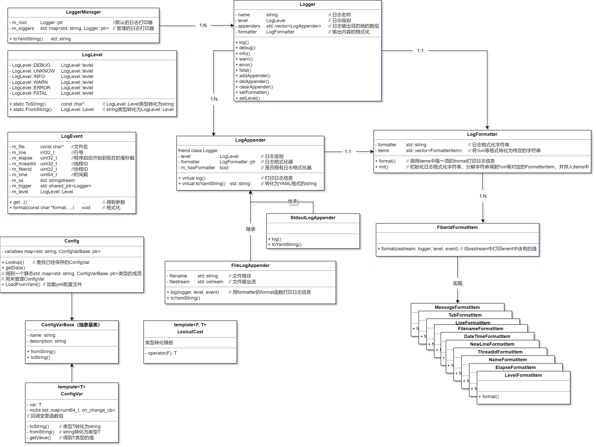

- 学习资料来源于B站[从零开始开发服务器框架(sylar)](https://www.bilibili.com/video/BV184411s7qF?p=6&vd_source=5d6d76d334316f75baefb2055d9ac8db)
- 希望能在后面修改框架，扩展成自己的服务器框架
- sylar框架QQ群：8151915

安装所需要到C++库

- yaml-cpp库
- boost库

实体类的关系

